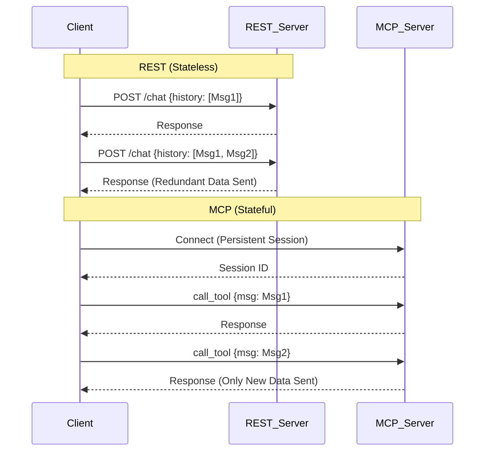

# REST vs MCP 2.0: Protocol Benchmark Suite


A comprehensive benchmarking toolkit designed to compare the performance and architectural differences between **REST APIs (Stateless)** and the **Model Context Protocol (MCP, Stateful)**. This project simulates real-world AI agent workflows to demonstrate how protocol choice impacts latency, bandwidth, and scalability.

---

## 🚀 Overview

As AI agents become more complex, the method of connecting them to data and tools becomes critical. This project provides a head-to-head comparison of two approaches:

1.  **REST API**: The traditional stateless approach where every request must contain the full context history.
2.  **MCP (Model Context Protocol)**: A stateful, connection-based standard (using JSON-RPC/SSE) designed specifically for LLMs to maintain context efficiently.

### Key Differentiators Tested
*   **Context Window Scaling**: How performance changes as chat history grows from 1 to 100+ messages.
*   **Network Conditions**: Simulation of 4G/LTE networks (High Latency, Low Bandwidth) to expose protocol overhead.
*   **Tool Chaining**: Efficiency of multi-step agent workflows.
*   **Real-time Updates**: Polling (REST) vs. Server-Sent Events (MCP).

---

## 📊 Visual Comparison



---

## 🛠️ Installation

1.  **Clone the repository**
    ```bash
    git clone https://github.com/yourusername/rest-vs-mcp-2.0.git
    cd rest-vs-mcp-2.0
    ```

2.  **Create a Virtual Environment (Recommended)**
    ```bash
    python -m venv venv
    # Windows
    .\venv\Scripts\activate
    # Mac/Linux
    source venv/bin/activate
    ```

3.  **Install Dependencies**
    ```bash
    pip install -r requirements.txt
    ```

---

## 💻 Usage

This project includes both a command-line interface for automated benchmarking and an interactive dashboard for visualization.

### 1. Interactive Dashboard (GUI)
The best way to explore the data. Launches a Streamlit app to visualize latency, bandwidth, and throughput in real-time.

```bash
python main.py --gui
```
*Or directly:*
```bash
streamlit run dashboard/app.py
```

### 2. CLI Benchmarks (Headless)
Run the full suite of advanced benchmarks and generate a CSV/Markdown report.

```bash
python main.py --cli --new_report
```
*   `--new_report`: Creates a timestamped report file instead of overwriting the default.

---

## 📂 Project Structure

```
REST vs MCP 2.0/
├── benchmarks/          # Core benchmarking logic and scenarios
├── clients/             # Client implementations (REST & MCP)
├── dashboard/           # Streamlit visualization app
├── reporting/           # Report generation utilities
├── reports/             # Output directory for CSV/MD results
├── servers/             # Server implementations
│   ├── rest_server.py   # FastAPI based REST server
│   └── mcp_server.py    # Custom JSON-RPC/SSE MCP server
├── main.py              # Entry point
└── requirements.txt     # Project dependencies
```

---

## 🧪 Benchmark Scenarios

The suite tests the following specific scenarios:

1.  **Stateful vs Stateless Context**: Simulates a growing conversation. Measures the impact of re-sending history (REST) vs. maintaining state (MCP).
2.  **Long-Running Tasks**: Compares "Polling" (REST) vs. "Push Notifications" (MCP) for tasks that take time to complete.
3.  **Real-time Stock Ticker**: Analyzes the overhead of high-frequency polling vs. subscription-based updates.
4.  **Tool Chaining**: Tests multi-step workflows where the output of one tool is the input for the next.
5.  **Network Simulation**: Applies artificial latency (e.g., 50ms) and bandwidth throttling (e.g., 5Mbps) to mimic real-world mobile conditions.

---

## 📄 License

Distributed under the MIT License. See `LICENSE` for more information.
