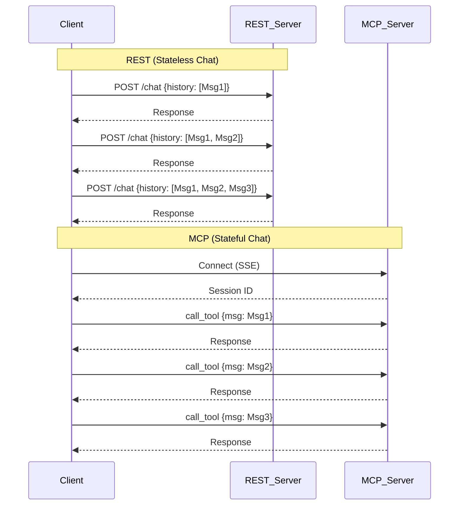

# REST vs MCP Benchmark: Comprehensive Documentation

## 1. Introduction
This project benchmarks and compares two distinct architectural approaches for building AI Agents and connecting them to data/tools:
1.  **REST API (Representational State Transfer)**: The industry standard for web services, relying on stateless HTTP requests.
2.  **MCP (Model Context Protocol)**: An open standard designed specifically for LLMs to connect to external context, relying on stateful connections and JSON-RPC.

This document explains the technical concepts, metrics, and configurations used in the benchmark suite.

---

## 2. Protocols & Technologies Explained

### 2.1. HTTP (Hypertext Transfer Protocol)
The foundation of data communication on the web.
*   **Role**: Used by both REST (exclusively) and MCP (for initial handshake and transport).
*   **Key Concept**: Request-Response cycle. The client asks, the server answers.

### 2.2. REST (Stateless)
*   **Architecture**: "Stateless" means the server does not remember previous interactions. Every request must contain all necessary context (e.g., the entire chat history).
*   **Mechanism**: Uses standard HTTP methods (`GET`, `POST`, `PUT`, `DELETE`).
*   **Polling**: To get updates (like a finished task), the client must repeatedly ask ("Is it done yet?"). This is resource-intensive.

### 2.3. MCP (Stateful)
*   **Architecture**: "Stateful" means the server establishes a persistent connection and remembers the session context.
*   **Mechanism**:
    *   **JSON-RPC**: A remote procedure call protocol encoded in JSON. It allows calling specific functions (`tools/call`) rather than just accessing resources.
    *   **SSE (Server-Sent Events)**: A standard allowing the server to push updates to the client over a single HTTP connection.
*   **Events**: The server can notify the client immediately when something changes (e.g., "Task Completed"), eliminating the need for polling.

### 2.4. Visual Comparison



---

## 3. Benchmark Configurations

The dashboard allows you to configure these parameters to simulate different environments:

### 3.1. Chat Turns (Iterations)
*   **Definition**: The number of back-and-forth exchanges in a conversation.
*   **Significance**: Tests how performance scales as the "Context Window" grows.
*   **Impact**:
    *   **REST**: Performance degrades linearly because the payload size increases with every turn (sending history 1 -> 2 -> ... -> 20).
    *   **MCP**: Performance remains stable because it only sends the *new* message; the server holds the history.

### 3.2. Concurrent Agents
*   **Definition**: The number of agents trying to access the server at the exact same millisecond.
*   **Significance**: Simulates a high-load production environment (e.g., an enterprise app with 50 active users).
*   **Metric**: **RPS (Requests Per Second)** - How many requests the server can handle before slowing down.

### 3.3. Network Conditions
We simulate "Real-World" constraints to move beyond localhost speed:
*   **Latency (ms)**: The delay for a signal to travel from Client -> Server. (e.g., 50ms for 4G).
*   **Bandwidth (Mbps)**: The "width of the pipe". Limits how much data can be sent per second.
*   **Packet Loss (%)**: The percentage of data packets that get lost and must be re-transmitted.

---

## 4. Metrics of Measurement

### 4.1. Latency (ms)
*   **What it is**: The time elapsed between sending a request and receiving the complete response.
*   **Why it matters**: Determines the "snappiness" of the AI. High latency = sluggish feel.
*   **Components**: Network Travel Time + Server Processing Time + Data Transfer Time.

### 4.2. Bandwidth / Data Transferred (Bytes)
*   **What it is**: The total amount of text/data sent over the network.
*   **Why it matters**:
    *   **Cost**: Cloud providers charge by the GB.
    *   **Speed**: On slow networks (mobile), sending large data takes a long time.
    *   **REST vs MCP**: REST typically uses 10x-100x more bandwidth in long conversations.

### 4.3. Throughput (RPS)
*   **What it is**: Requests Per Second.
*   **Why it matters**: Measures server capacity. Higher is better.

### 4.4. Overhead
*   **What it is**: "Wasted" effort.
*   **Polling Overhead**: In REST, if you check status 10 times and the task finishes on the 10th, the first 9 requests were pure overhead (waste).
*   **Protocol Overhead**: The extra bytes (headers, JSON structure) required to wrap the actual message.

---

## 5. Scenarios Breakdown

### 5.1. Stateful vs Stateless Context (Chat)
*   **Scenario**: A user having a conversation with an AI.
*   **REST**: Sends `[Msg1, Msg2, Msg3...]` every time.
*   **MCP**: Sends `Msg4`. Server remembers `[Msg1, Msg2, Msg3]`.
*   **Visual**: "Latency Growth" graph shows REST climbing (linear) vs MCP staying flat.

### 5.2. Long-Running Tasks (Push vs Pull)
*   **Scenario**: Generating a large image or report that takes 5 seconds.
*   **REST (Pull)**: Client asks "Ready?" every 0.5s. (10 requests).
*   **MCP (Push)**: Client asks once. Server sends a "Progress" event, then a "Done" event. (1 request).

#### Implementation Comparison

| Feature | REST (Polling) | MCP (Events) |
| :--- | :--- | :--- |
| **Client Logic** | `while status != "done": sleep(1); check()` | `listen_for_event("progress")` |
| **Network** | Many Requests | Single Connection |
| **Latency** | High (Wait time + Polling Interval) | Low (Instant Notification) |

### 5.3. Real-time Stock Ticker
*   **Scenario**: Monitoring a stock price that changes randomly.
*   **REST**: Polling every 100ms to catch changes.
*   **MCP**: **Subscription**. Client says "Subscribe to AAPL". Server sends a message *only* when the price changes.

### 5.4. Tool Chaining
*   **Scenario**: A multi-step workflow (e.g., `Get Data` -> `Analyze` -> `Summarize`).
*   **REST**: Client must orchestrate: Call A, get result, pass to B, get result, pass to C.
*   **MCP**: Client can potentially ask server to "Run Workflow", or efficiently chain calls over the persistent connection.

### 5.5. Real-World Simulation
*   **Scenario**: Simulating a 4G mobile network (50ms latency, 5Mbps speed).
*   **Insight**: This is where REST fails hard. The large payloads (History) clog the narrow bandwidth, causing massive latency spikes (1.5s+), whereas MCP remains fast (~400ms).

---

## 6. How to Run

### 6.1. CLI Mode (Headless)
Run the benchmarks directly from the terminal to generate a CSV report.
```bash
python main.py --cli --new_report
```

### 6.2. Dashboard (GUI)
Launch the interactive Streamlit dashboard to visualize the results.
```bash
streamlit run dashboard/app.py
```

### 6.3. Interpreting Results
*   **Latency Graphs**: Lower is better. Look for the slope of the line (Steep = Bad scaling).
*   **Bandwidth Graphs**: Lower is better.
*   **Throughput (RPS)**: Higher is better.

